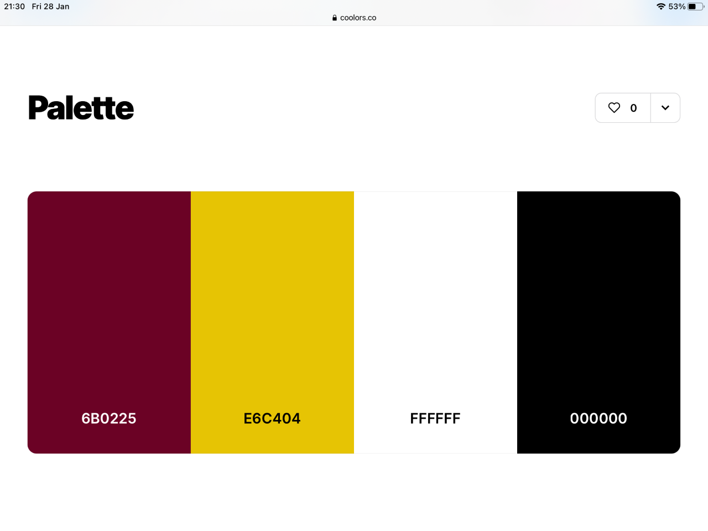
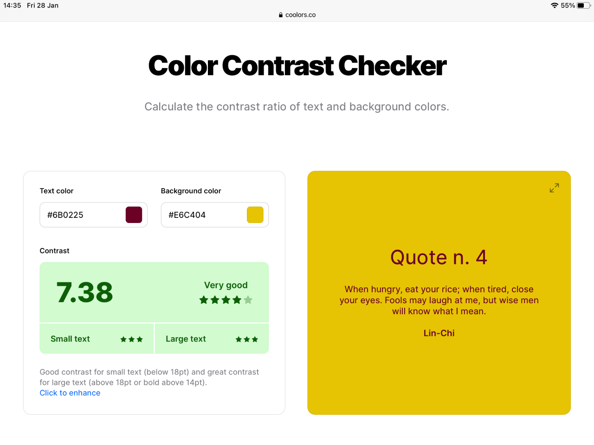
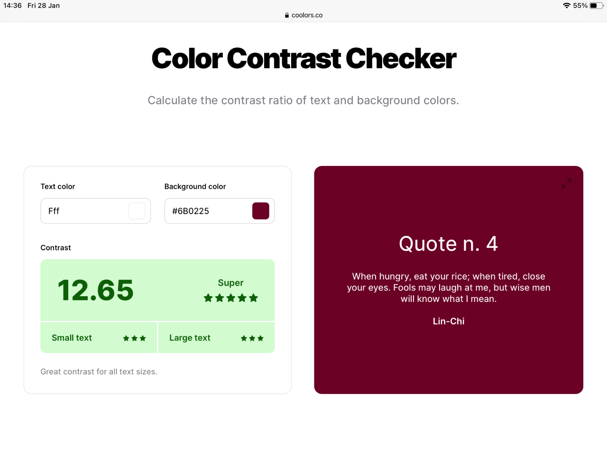
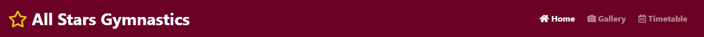
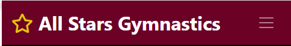
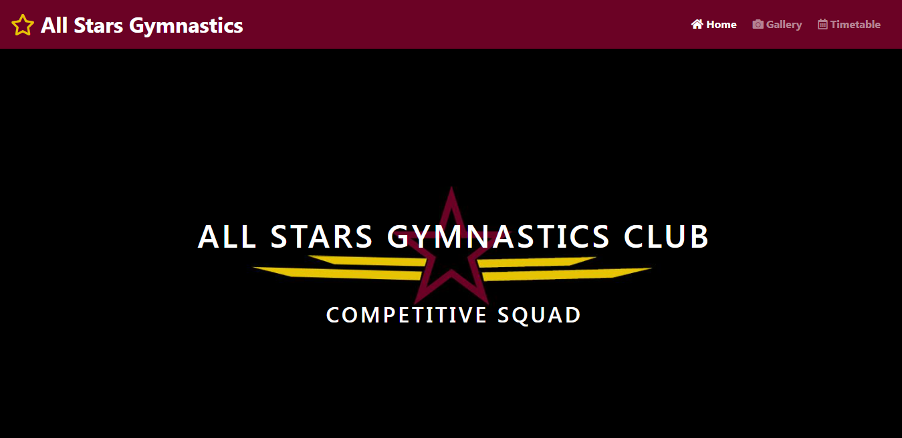
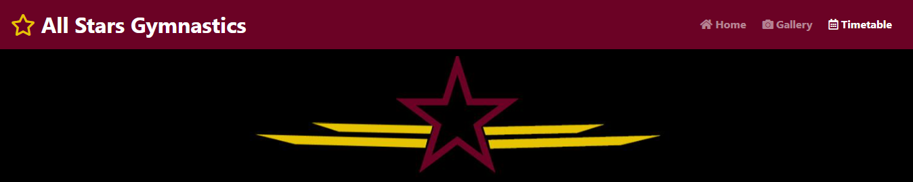
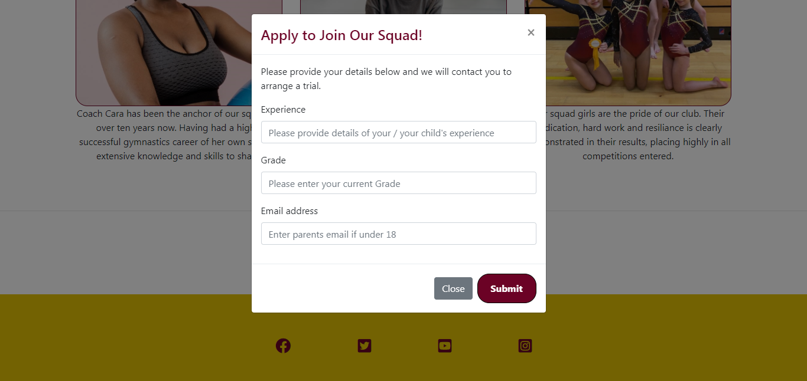

# ALL STARS SQUAD WEBSITE

## View the live project [here](https://cherylethomas.github.io/portfolio-project/)
***

This website is designed to be a homepage for my daughter's gymnastics squad.  This is a competitive squad and the website will document their achievements in a gallery for the squad members as well as showcase the squad for potential new gymnasts.  

## User Experience (UX)
***

### User Stories

#### First Time Visitor Goals

* First time visitors should be able to easily navigate around the site.
* First time visitors should be able to use the site to find out about the squad and be able to sign up to join.

#### Returning Visitor Goals

* Returning visitors should be able to find information about upcoming competitions and events.
* Returning visitors should be able to contact the squad management team if required.

#### Frequent User Goals

* Frequent users (i.e. members) should be able to view photos of their achievements on the gallery page.
* Frequent users (i.e. members) should be able to access social media links.

### Design

#### Colour Scheme

* The squad colours are black, maroon and gold.  The site uses corresponding maroon, yellow and black colours along with a basic white to prevent the site appearing too dark.

* The colour scheme was checked for colour contrast suitability using [Coolors](https://coolors.co/) to ensure that the chosen colours would be suitably accessible.

#### Typography

* The [Google fonts](https://fonts.google.com/) font "Poppins" is the main font for the site.  Poppins is a simple, clear font which is easily read and understood.

#### Imagery

* The large background hero image is the gymnastics club logo.  This clearly identifies the site and the club which the squad is part of.  
* Images of the Coach and Assistant on the home page are stock images from [Pexels](https://www.pexels.com/) as I did not have permission to include images of the club staff.
* Images on the gallery page are of my daughter and other members of the squad. Permission was sought and granted from their parents to include images of the other children in the squad.

### Wireframes

Wireframes were produced using [Balsamiq](https://balsamiq.com/) to help form a visual guide of how I wanted the site to look once finished:

* Home Page Wireframe - [View](https://share.balsamiq.com/c/wcDidgzBGrRnwUU5zMEy4C.png)
* Mobile Wireframe - [View](https://share.balsamiq.com/c/9QLVk78Zx9n3GGKZbMNn8Q.png)
* Gallery Page Wireframe - [View](https://share.balsamiq.com/c/2CRQfKaw6aEbVEZGiiE2qj.png)
* Timetable Page Wireframe - [View](https://share.balsamiq.com/c/eUZEZ6Ui7hyF8uUzGNnunX.png)

## Features
***

### Navigation Bar
* The navigation bar is fully responsive.  It features buttons which link to the Home, Gallery and Timetable pages.  These links are fully visible on larger screens, but collapse down on mobile screens.  The club name on the right hand side of the navigation bar also acts as a link back to the home page which is always accessible on every page at all screen sizes. 

### Hero Image
* The Home page features a hero image to present the club logo and the main header of the club name to the user.  I initially planned to use this same format on all pages to maintain a consistent design across the site, however in reality this looked too large on the Gallery and Timetable pages and so I reduced the size of the hero image and omitted the text for these pages which works better visually for the sub pages. I utilised an animation effect on the hero image to draw the eye at first glance.

### Meet the Squad
* The Home page features photos and introductions to the members of the squad.  The section of the page is responsive to screen sizes.  On a large screen all three sections are visible side by side.  On a medium size screen this reduces to two sections side by side and on a mobile screen the sections run singly one after each other.

### Application Modal
* The Home page also features a button which takes the user to an interactive pop-up modal where they can apply to join the squad.

### Footer
* All pages feature the same footer which provides links to the squad's various social media platforms via their corresponding icons.

### Gallery
* The Gallery page features photos from the squads competitions, club sessions and a photoshoot.  It gives a visual guide to the squad to users and provides a record of achievements to squad members.  This page is responsive to screen sizes.  Images are shown in four columns on larger screens and in two colums on medium and mobile screens.

### Timetable
* The Timetable page provides information on when and where the squads meets and trains and also has a timeline for upcoming events. 

### Future Features
Additional features which could be included in the future include:
* Addition of a Contact button to allow the user to get in touch with the squad management team.
* Links on the Upcoming Events section to allow users to register at events directly from the page.
* A page with links to the main gymnastics club site and the various other teams and groups of the club.
* A members only page which requires log-in details and which could allow members to access their training schedules, gradings, etc.
* Provide Welsh language versions of the pages for bilingual users. 

## Technologies Used
***

The following technologies were used in the production and testing of the site:

* [HTML5](https://en.wikipedia.org/wiki/HTML5) - for the main page structure.
* [CSS3](https://en.wikipedia.org/wiki/CSS) - for styling of the pages and features.
* Code Institute GitPod Full Template - for the site basis.
* Code Institute Sample README Template - for the README basis.
* [Bootstrap](https://getbootstrap.com/) - for formatting and styling components of the pages.
* [Font Awesome](https://fontawesome.com/) - for icons to enhance features.
* [Balsamiq](https://balsamiq.com/) - for producing wireframe designs.
* [GitHub](https://github.com/) - for file storage and deployment.
* [GitPod](https://www.gitpod.io/) - for the Integrated Development Environment.
* [Coolors](https://coolors.co/) - for assessing colour schemes.
* [Google Fonts](https://fonts.google.com/) - for the site font.
* [Pexels](https://www.pexels.com/) - for stock images.
* Google Developer Tools - for testing, reviewing and styling the pages.
* [WAVE](https://wave.webaim.org/) - for checking site accessibility.
* [Jigsaw](https://jigsaw.w3.org/css-validator/) - for validating CSS code.
* [W3](https://validator.w3.org/) - for validating HTML code.
* Lighthouse - for testing the site.
* [Git](https://git-scm.com/) - for version control.

## Testing
***
Please refer to TESTING.md for all testing documentation.

## Deployment
***

### GitHub Pages

The project was deployed to GitHub Pages using the following steps...

1. Log in to GitHub and locate the [GitHub Repository](https://github.com/CherylEThomas/portfolio-project)
2. At the top of the Repository (not top of page), locate the "Settings" Button on the menu.
3. Scroll down the Settings page until you locate the "Pages" Section in the left hand side menu.
4. Under "Source", click the dropdown called "None" and select "Main Branch".
5. Click "Save" and refresh the page.
6. Locate the now published site link in the "GitHub Pages" section.

The link created for the site is [here](https://cherylethomas.github.io/portfolio-project/)

## Credits
***

### Code

* The Code Institute tutorial projects for Love Running, Whiskey Drop and Rosie's Resume were utilised for inspiration and code elements throughout the project.  Comments in the code indicate where these were used more clearly.  Where code from tutorial projects was used, this was modified and altered by myself to suit this project.  

* [Bootstrap4](https://getbootstrap.com/docs/4.4/getting-started/download/) Bootstrap Library used throughout the project mainly to make site responsive using the Bootstrap Grid System.

### Content

* All content was written by the developer.

* [README template](https://github.com/Code-Institute-Solutions/SampleREADME) Code Institute README template was used as the basis for this file.

* [Gitpod template](https://github.com/Code-Institute-Org/gitpod-full-template) Code Institute template was used as the basis for the site pages.

### Acknowledgements

* My Mentor Victor Miclovich for helpful guidance and feedback throughout the project.
* Fellow students on Slack for providing invaluable help and solutions.
* My family and friends for testing the site.
* All Stars Gymnastics Club Squad for the inspiration.
* Squad parents for allowing me to use images of their children.